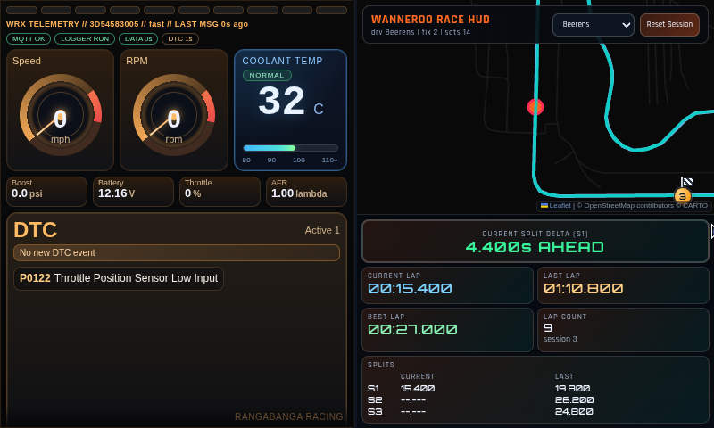
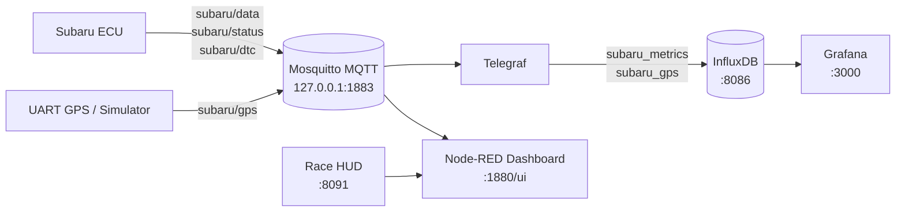

# Subaru Pi Platform

Raspberry Pi stack for Subaru ECU telemetry, live dashboarding, GPS race HUD, and time-series storage.

## Live Dashboard Screenshot (Pi)
Captured on this Pi on February 20, 2026:



## Architecture Diagram


## Architecture (Separation of Concerns)
This repo is intentionally componentized so each runtime does one job well and communicates over MQTT.

Flow at a glance:
1. `telemetry/ssm_logger.py` polls the Subaru ECU and publishes JSON to MQTT topics (`subaru/data`, `subaru/status`, `subaru/dtc`, and metric topics).
2. `gps/gps_to_mqtt_fast.py` (or `gps/gps_wanneroo_sim.py`) publishes location/track data to `subaru/gps`.
3. Telegraf subscribes to MQTT topics and writes:
   - `subaru/data` -> Influx measurement `subaru_metrics`
   - `subaru/gps` -> Influx measurement `subaru_gps`
4. Node-RED dashboard renders ECU telemetry and embeds the race HUD (`:8091`) for GPS/lap visuals.
5. Grafana reads InfluxDB for historical analysis and tuning/trend dashboards.

Why this architecture:
- Decoupling: producers (ECU/GPS) do not depend on consumers (dashboard, storage, alerts).
- Replaceability: you can swap simulator vs real GPS, or Node-RED vs Grafana views, without changing telemetry publishers.
- Fault isolation: if one UI/service restarts, core publishers and other subscribers keep running.
- Reuse: the same MQTT stream feeds live UI, storage, automation, and debugging tools simultaneously.
- Operability: each component can be tested independently with `mosquitto_sub`, service logs, and topic-level smoke checks.

## What This Repo Provides
- `telemetry/`: Subaru SSM2/K-line ECU polling and MQTT publishing (`subaru/*`)
- `observability/`: InfluxDB + Grafana + Node-RED + Telegraf ingest
- `gps/`: real UART GPS publisher, race simulator, and race HUD web server
- `scripts/`: install and service bootstrap helpers
- `docs/`: setup/troubleshooting/runbook docs for humans and automation

## Hardware
Minimum:
- Raspberry Pi 4/5
- microSD (32GB+ recommended)
- LAN/Wi-Fi connectivity

ECU telemetry:
- Subaru-compatible K-line adapter on `/dev/ttyUSB0`

GPS (optional):
- UART GPS module wired to Pi UART (`/dev/ttyS0`)

Display/kiosk (optional):
- HDMI/DSI screen for always-on dashboard

## Software Baseline
- Raspberry Pi OS Bookworm (64-bit recommended)
- Docker + Compose plugin
- Mosquitto broker
- Python 3

## Quick Start (Fresh Clone)
1. Clone:
```bash
git clone <your-repo-url> ~/subaru-pi-platform
cd ~/subaru-pi-platform
```
2. Install prerequisites:
```bash
bash scripts/install_prereqs.sh
```
3. Configure ECU telemetry service:
```bash
bash scripts/setup_telemetry_service.sh
```
4. Configure observability env:
```bash
cp observability/.env.example observability/.env
nano observability/.env
```
5. Start observability stack:
```bash
bash scripts/start_observability.sh
```
6. Enable observability stack at boot:
```bash
bash scripts/setup_observability_service.sh
```

## Runtime URLs
- Node-RED UI: `http://<pi-ip>:1880/`
- Main dashboard: `http://<pi-ip>:1880/ui/`
- Grafana: `http://<pi-ip>:3000`
- InfluxDB: `http://<pi-ip>:8086`
- Race HUD server (if running): `http://<pi-ip>:8091/`

Note: the Node-RED main dashboard embeds race HUD from `:8091` on the right pane.

## GPS Requirements (What You Need)
Hardware:
- UART GPS module connected to Pi UART (`/dev/ttyS0`)
- Common wiring: GPS `TX -> Pi RX`, GPS `RX -> Pi TX`, plus `3.3V` and `GND`

Pi serial/UART setup:
```bash
sudo raspi-config
# Interface Options -> Serial Port
# "Login shell over serial?" -> No
# "Enable serial port hardware?" -> Yes
sudo reboot
```

If `ttyS0` is still occupied by a login service:
```bash
sudo systemctl stop serial-getty@ttyS0.service
sudo systemctl disable serial-getty@ttyS0.service
sudo systemctl mask serial-getty@ttyS0.service
```

Start GPS publisher and HUD:
```bash
cd /home/pi/subaru-pi-platform/gps
python3 gps_to_mqtt_fast.py --serial-port /dev/ttyS0 --mqtt-topic subaru/gps
python3 mqtt_gps_map_server.py --mqtt-topic subaru/gps --host 0.0.0.0 --port 8091
```

Quick GPS checks:
```bash
mosquitto_sub -h 127.0.0.1 -v -t 'subaru/gps' -C 1 -W 10
ls -l /dev/ttyS0
```

## Verification
Telemetry topics:
```bash
mosquitto_sub -h 127.0.0.1 -v -t 'subaru/status' -C 1 -W 10
mosquitto_sub -h 127.0.0.1 -v -t 'subaru/data' -C 1 -W 10
```
Influx ingest (`subaru_metrics`):
```bash
source observability/.env
curl -sS \
  -H "Authorization: Token $INFLUXDB_TOKEN" \
  -H "Content-Type: application/vnd.flux" \
  -H "Accept: application/csv" \
  "http://127.0.0.1:8086/api/v2/query?org=$INFLUXDB_ORG" \
  --data-binary "from(bucket: \"$INFLUXDB_BUCKET\") |> range(start: -2m) |> filter(fn: (r) => r._measurement == \"subaru_metrics\") |> limit(n: 5)"
```
GPS ingest (`subaru_gps`):
```bash
source observability/.env
curl -sS \
  -H "Authorization: Token $INFLUXDB_TOKEN" \
  -H "Content-Type: application/vnd.flux" \
  -H "Accept: application/csv" \
  "http://127.0.0.1:8086/api/v2/query?org=$INFLUXDB_ORG" \
  --data-binary "from(bucket: \"$INFLUXDB_BUCKET\") |> range(start: -2m) |> filter(fn: (r) => r._measurement == \"subaru_gps\") |> limit(n: 5)"
```

## Human + Robot Docs
- Human setup: `docs/SETUP_PI.md`
- Human troubleshooting: `docs/TROUBLESHOOTING.md`
- Topic contracts: `docs/MQTT_TOPICS.md`
- GPS usage: `gps/README.md`
- Robot/operator runbook: `docs/OPERATIONS.md`
- Robot agent guide: `AGENTS.md`
- Git push flow: `docs/GIT_PUBLISH.md`
